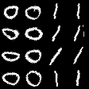

Official repository for the paper "Mask and Compress: Efficient Skeleton-based Action Recognition in Continual Learning" (ICPR 2024).
This repository is based on the original [Mammoth](https://github.com/aimagelab/mammoth). Backbones, datasets and models are kept for compatibility with the original repository.

<p align="center">
  
</p>

# Mammoth - An Extendible (General) Continual Learning Framework for Pytorch

<p align="center">
  
  
  
  
  
  
</p>

## Setup for CHARON

+ Use `./utils/main.py` to run experiments.
+ Use argument `--model CHARON` to run our model.

## Models

+ Continual Human Action Recognition On skeletoNs (CHARON)
+ eXtended-DER (X-DER)
+ Dark Experience Replay (DER)
+ Dark Experience Replay++ (DER++)
+ Learning a Unified Classifier Incrementally via Rebalancing (LUCIR)
+ Greedy Sampler and Dumb Learner (GDumb)
+ Bias Correction (BiC)
+ Regular Polytope Classifier (RPC)
+ Gradient Episodic Memory (GEM)
+ Averaged GEM (A-GEM)
+ A-GEM with Reservoir (A-GEM-R)
+ Experience Replay (ER)
+ Meta-Experience Replay (MER)
+ Function Distance Regularization (FDR)
+ Greedy gradient-based Sample Selection (GSS)
+ Hindsight Anchor Learning (HAL)
+ Incremental Classifier and Representation Learning (iCaRL)
+ online Elastic Weight Consolidation (oEWC)
+ Synaptic Intelligence (SI)
+ Learning without Forgetting (LwF)
+ Progressive Neural Networks (PNN)

## Datasets
+ Sequential NTU-60 (*Class-Il / Task-IL*)
+ Sequential NTU-120 (*Class-Il / Task-IL*)
+ Sequential MNIST (*Class-Il / Task-IL*)
+ Sequential CIFAR-10 (*Class-Il / Task-IL*)
+ Sequential CIFAR-100 (*Class-Il / Task-IL*)
+ Sequential Tiny ImageNet (*Class-Il / Task-IL*)
+ Permuted MNIST (*Domain-IL*)
+ Rotated MNIST (*Domain-IL*)
+ MNIST-360 (*General Continual Learning*)

## Citing this work

```
@inproceedings{mosconi2024mask,
  title={Mask and Compress: Efficient Skeleton-based Action Recognition in Continual Learning},
  author={Mosconi, Matteo and Sorokin, Andriy and Panariello, Aniello and Porrello, Angelo and Bonato, Jacopo and Cotogni, Marco and Sabetta, Luigi and Calderara, Simone and Cucchiara, Rita},
  booktitle={International Conference on Pattern Recognition},
  year=2024
}
```
